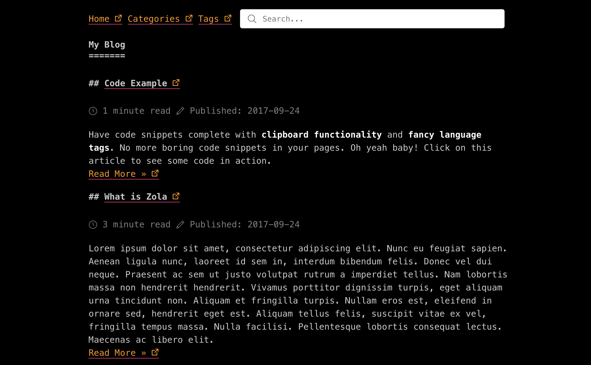

# after-after-dark

Enhancements to the [`after-dark`](https://github.com/getzola/after-dark) Zola
theme originally developmed by Vincent Prouillet.

Demo: https://micahkepe.com/blog/

## Acknowledgements

Lots of inspiration and code snippets taken from [`redux`](https://github.com/SeniorMars/redux)
by [SeniorMars](https://github.com/SeniorMars). Go check out his theme and blog!



## Features

- [x] Code Snippet Clipboards
- [x] Latex Support
- [ ] Light/Dark mode support
- [ ] Search functionality

## Contents

- [Installation](#installation)
- [Options](#options)
  - [Top menu](#top-menu)
  - [Title](#title)
  - [Author](#author)
  - [Code Snippets](#code-snippets)

## Installation

First download this theme to your `themes` directory:

```bash
cd themes
git clone https://github.com/micahkepe/after-after-dark
```

and then enable it in your `config.toml`:

```toml
theme = "after-after-dark"
```

This theme requires your index section (`content/_index.md`) to be paginated to work:

```toml
paginate_by = 5
```

The posts should therefore be in directly under the `content` folder.

The theme requires tags and categories taxonomies to be enabled in your `config.toml`:

```toml
taxonomies = [
    # You can enable/disable RSS
    {name = "categories", feed = true},
    {name = "tags", feed = true},
]
```

If you want to paginate taxonomies pages, you will need to overwrite the templates
as it only works for non-paginated taxonomies by default.

## Options

### Top-menu

Set a field in `extra` with a key of `after_dark_menu`:

```toml
after_dark_menu = [
    {url = "$BASE_URL", name = "Home"},
    {url = "$BASE_URL/categories", name = "Categories"},
    {url = "$BASE_URL/tags", name = "Tags"},
    {url = "https://google.com", name = "Google"},
]
```

If you put `$BASE_URL` in a url, it will automatically be replaced by the actual
site URL.

### Title

The site title is shown on the homepage. As it might be different from the `<title>`
element that the `title` field in the config represents, you can set the `after_dark_title`
instead.

### Author

You can set this on a per page basis or in the config file.

`config.toml`:

```toml
[extra]
author = "John Smith"
```

In a page (wrap this in +++):

```toml
title = "..."
date = 1970-01-01

[extra]
author = "John Smith"
```

### Code Snippets

Syntax Highlighting:

```toml
[markdown]
# Whether to do syntax highlighting
# Theme can be customized by setting the `highlight_theme` variable to a theme supported by Zola
highlight_code = true

highlight_theme = "one-dark"
```

Enhanced Codeblocks (Clipboard Support and Language Tags)

```toml
[extra]
codeblock = true
```
